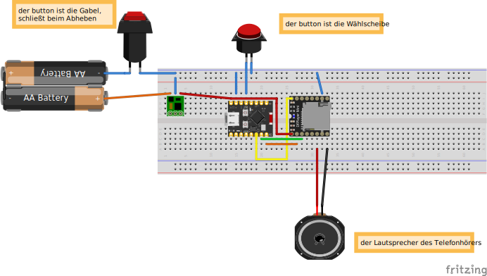

# GeoCache-Telefon

Das ist im Wesentlichen der Code von [Oliver Mezger](https://mezdata.de/mez-entwicklung/090_exitroom-telefon/index.php) angepasst an DFRobotDFPlayerMini und meine Bedürfnisse.
Das Ganze wird betrieben von 2x AA Batterien mit einen Step up Wandler der 5V draus macht.
Um Strom zu sparen wird die Telefongabel als Einschalter genutzt.
Die Wählscheibe wird als digitaler pull up genutzt.

## Aufbau

## Audios
Die Audios habe ich mit pico2wave und sox erzeugt.
